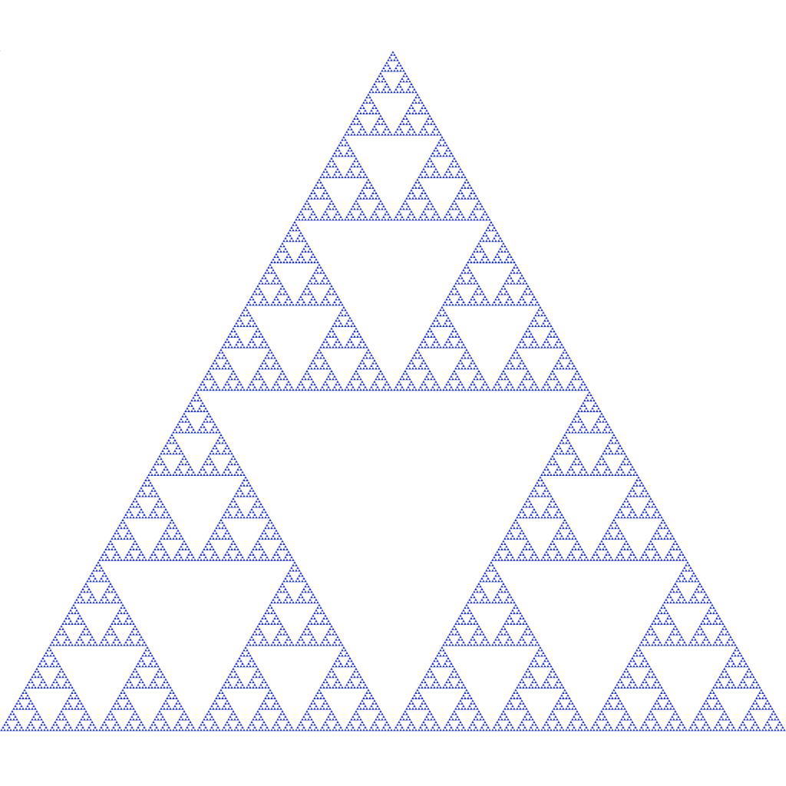
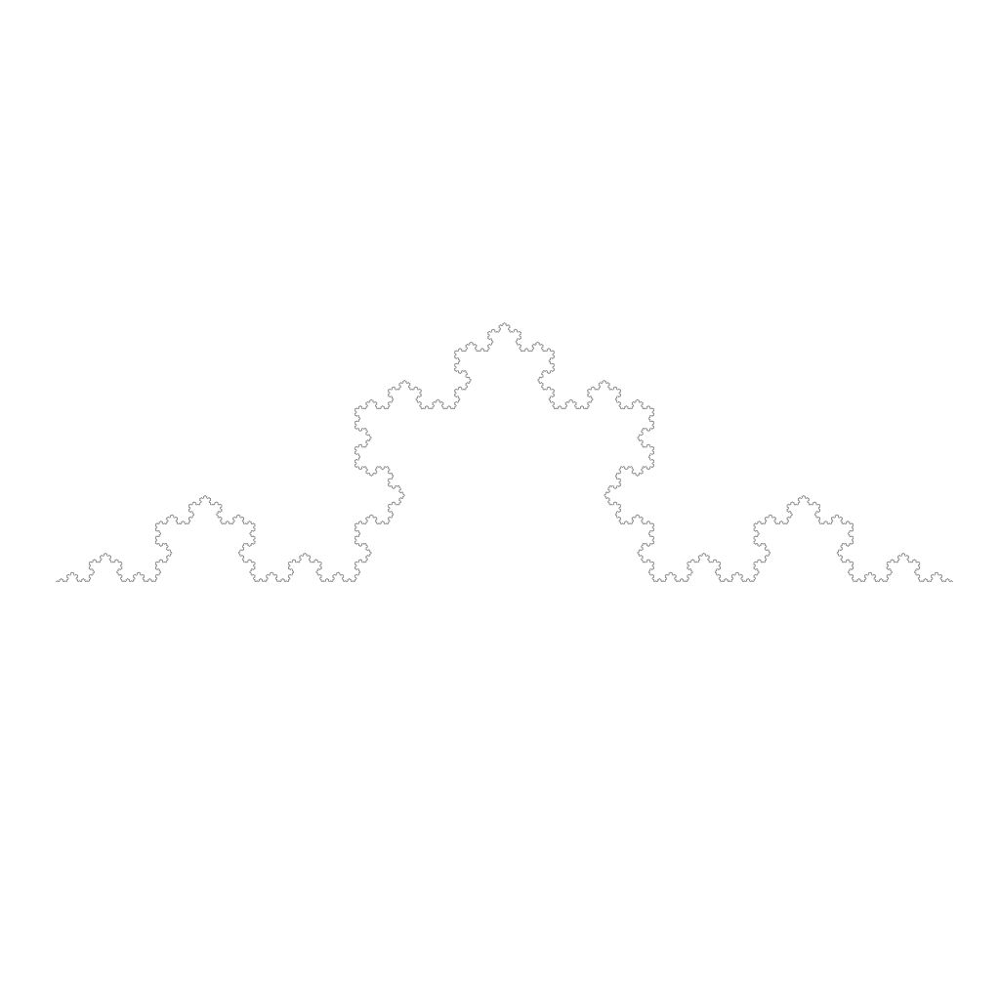
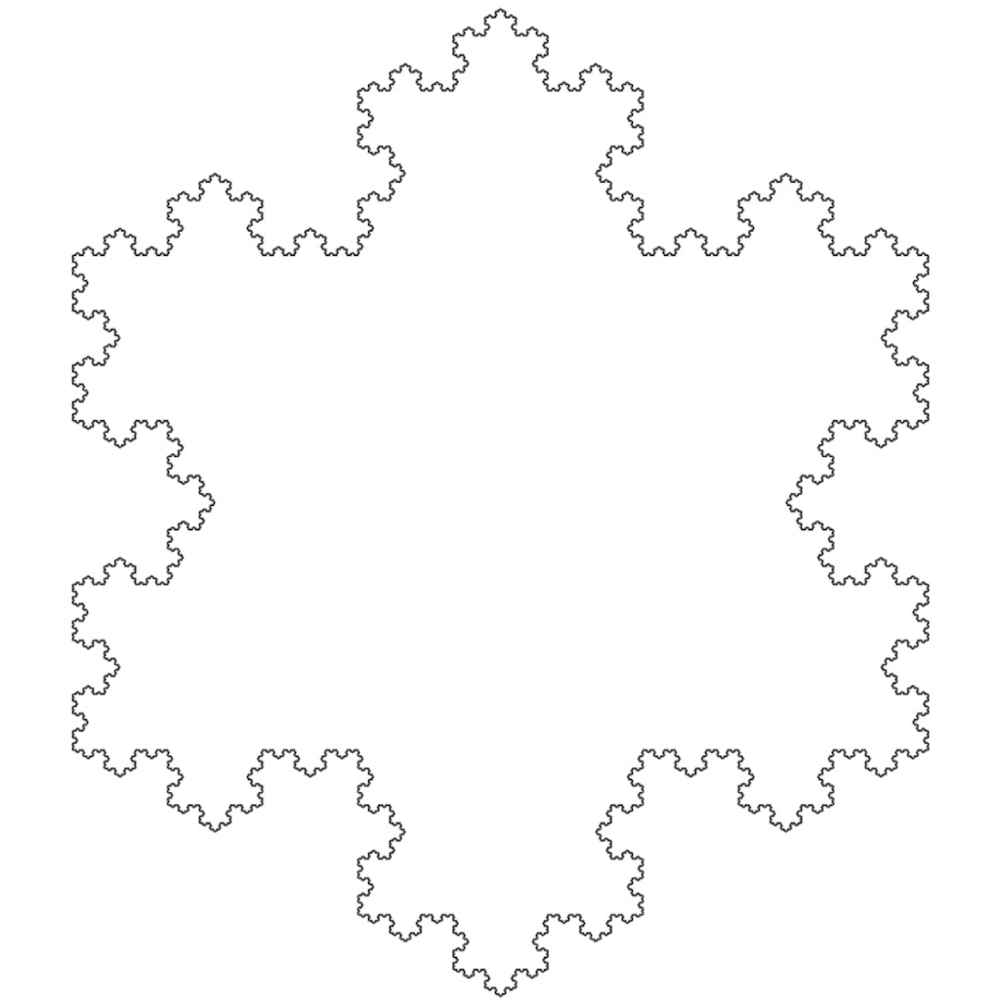
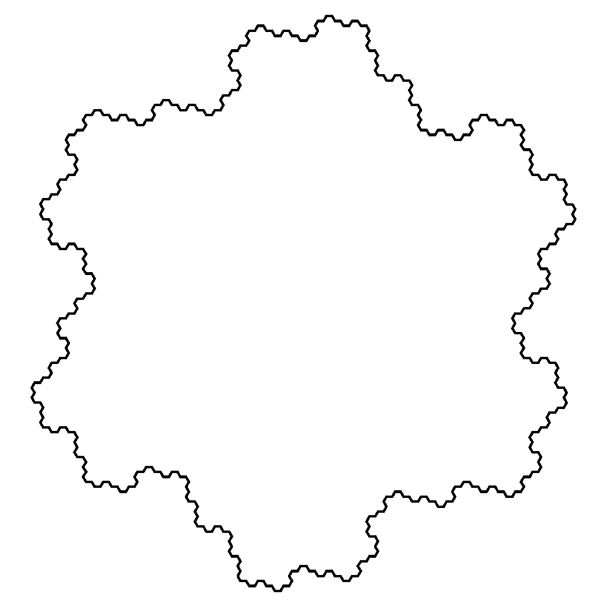
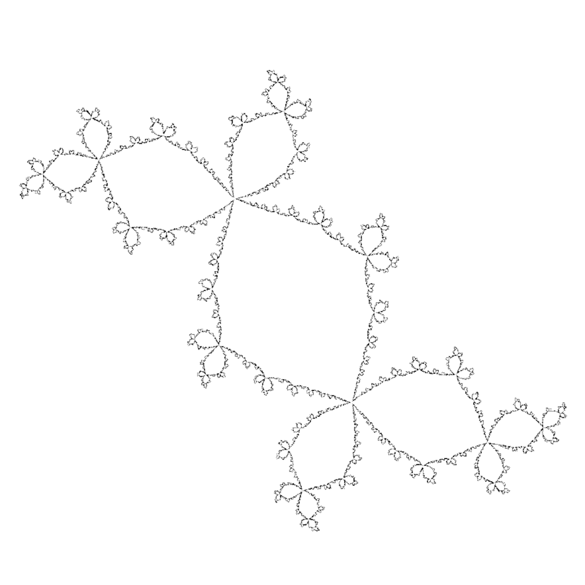
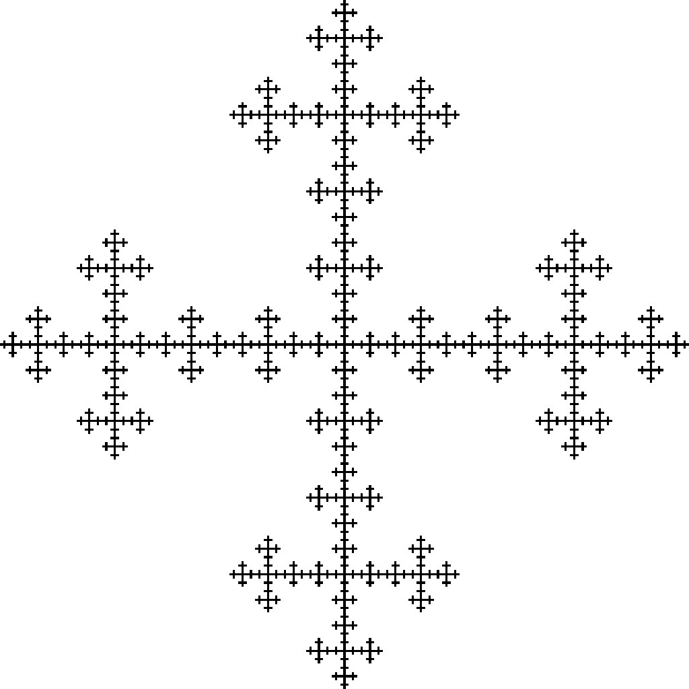
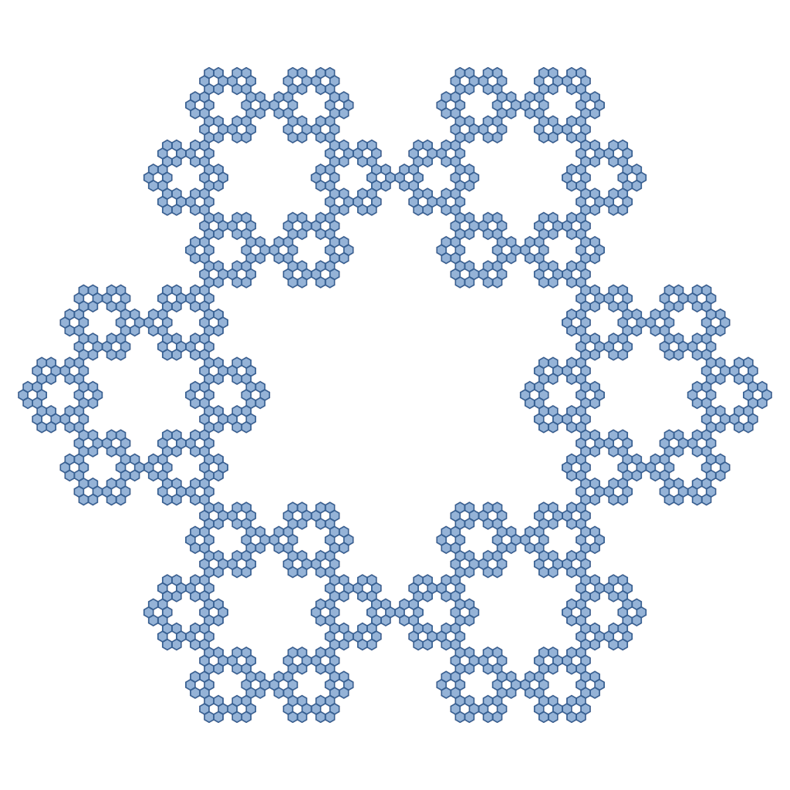
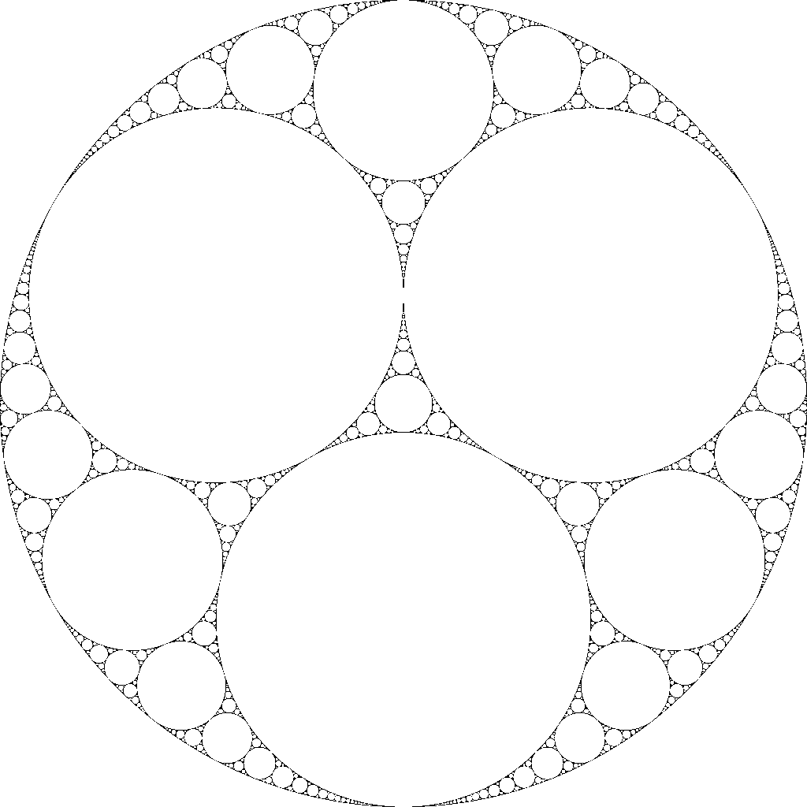

# BoxCounting
The Box Counting method calculates the Fractal Dimension of an image. It is a way to quantify the complexity and self-similarity of irregular shapes. The algorithm reads a 1024x1024 PNG image and returns its Fractal Dimension.

+-----------------------+----------------------------------------------------------------+--------------------------+--------------------------+
| Name                  | Illustration                                                   | ::: {#table:Fractals}    | ::: {#table:Fractals}    |
|                       |                                                                |   ------------------- -- |   ------------------- -- |
|                       |                                                                |       Theoretical        |       Calculated         |
|                       |                                                                |    fractal dimension     |    fractal dimension     |
|                       |                                                                |   ------------------- -- |   ------------------- -- |
|                       |                                                                |                          |                          |
|                       |                                                                |   : Fractals with known  |   : Fractals with known  |
|                       |                                                                |   fractal dimension      |   fractal dimension      |
|                       |                                                                | :::                      | :::                      |
+:=====================:+:==============================================================:+:========================:+:========================:+
| ::: {#table:Fractals} | ::: {#table:Fractals}                                          | ::: {#table:Fractals}    | ::: {#table:Fractals}    |
|   ------------ --     |   --------------------------------------------------------- -- |   ------- --             |   ------- --             |
|    Sierpinski         |         |    1.585                 |    1.582                 |
|     Triangle          |   --------------------------------------------------------- -- |   ------- --             |   ------- --             |
|   ------------ --     |                                                                |                          |                          |
|                       |   : Fractals with known fractal dimension                      |   : Fractals with known  |   : Fractals with known  |
|   : Fractals with     | :::                                                            |   fractal dimension      |   fractal dimension      |
|   known fractal       |                                                                | :::                      | :::                      |
|   dimension           |                                                                |                          |                          |
| :::                   |                                                                |                          |                          |
+-----------------------+----------------------------------------------------------------+--------------------------+--------------------------+
| ::: {#table:Fractals} | ::: {#table:Fractals}                                          | ::: {#table:Fractals}    | ::: {#table:Fractals}    |
|   ------- --          |   ----------------------------------------------- --           |   ------- --             |   ------- --             |
|    Koch               |                   |    1.262                 |    1.263                 |
|    Curve              |   ----------------------------------------------- --           |   ------- --             |   ------- --             |
|   ------- --          |                                                                |                          |                          |
|                       |   : Fractals with known fractal dimension                      |   : Fractals with known  |   : Fractals with known  |
|   : Fractals with     | :::                                                            |   fractal dimension      |   fractal dimension      |
|   known fractal       |                                                                | :::                      | :::                      |
|   dimension           |                                                                |                          |                          |
| :::                   |                                                                |                          |                          |
+-----------------------+----------------------------------------------------------------+--------------------------+--------------------------+
| ::: {#table:Fractals} | ::: {#table:Fractals}                                          | ::: {#table:Fractals}    | ::: {#table:Fractals}    |
|   ----------- --      |   --------------------------------------------------- --       |   ------- --             |   ------- --             |
|      Koch             |               |    1.262                 |    1.572                 |
|    Snowflake          |   --------------------------------------------------- --       |   ------- --             |   ------- --             |
|   ----------- --      |                                                                |                          |                          |
|                       |   : Fractals with known fractal dimension                      |   : Fractals with known  |   : Fractals with known  |
|   : Fractals with     | :::                                                            |   fractal dimension      |   fractal dimension      |
|   known fractal       |                                                                | :::                      | :::                      |
|   dimension           |                                                                |                          |                          |
| :::                   |                                                                |                          |                          |
+-----------------------+----------------------------------------------------------------+--------------------------+--------------------------+
| ::: {#table:Fractals} | ::: {#table:Fractals}                                          | ::: {#table:Fractals}    | ::: {#table:Fractals}    |
|   -------- --         |   --------------------------------------------------- --       |   ------- --             |   ------- --             |
|    Gosper             |               |    1.129                 |    1.275                 |
|    Island             |   --------------------------------------------------- --       |   ------- --             |   ------- --             |
|   -------- --         |                                                                |                          |                          |
|                       |   : Fractals with known fractal dimension                      |   : Fractals with known  |   : Fractals with known  |
|   : Fractals with     | :::                                                            |   fractal dimension      |   fractal dimension      |
|   known fractal       |                                                                | :::                      | :::                      |
|   dimension           |                                                                |                          |                          |
| :::                   |                                                                |                          |                          |
+-----------------------+----------------------------------------------------------------+--------------------------+--------------------------+
| ::: {#table:Fractals} | ::: {#table:Fractals}                                          | ::: {#table:Fractals}    | ::: {#table:Fractals}    |
|   -------- --         |   --------------------------------------------------- --       |   ------- --             |   ------- --             |
|    Douady             |               |    1.393                 |    1.477                 |
|    rabbit             |   --------------------------------------------------- --       |   ------- --             |   ------- --             |
|   -------- --         |                                                                |                          |                          |
|                       |   : Fractals with known fractal dimension                      |   : Fractals with known  |   : Fractals with known  |
|   : Fractals with     | :::                                                            |   fractal dimension      |   fractal dimension      |
|   known fractal       |                                                                | :::                      | :::                      |
|   dimension           |                                                                |                          |                          |
| :::                   |                                                                |                          |                          |
+-----------------------+----------------------------------------------------------------+--------------------------+--------------------------+
| ::: {#table:Fractals} | ::: {#table:Fractals}                                          | ::: {#table:Fractals}    | ::: {#table:Fractals}    |
|   --------- --        |   -------------------------------------------- --              |   ------- --             |   ------- --             |
|    Vicsek             |                      |    1.465                 |    1.446                 |
|    fractal            |   -------------------------------------------- --              |   ------- --             |   ------- --             |
|   --------- --        |                                                                |                          |                          |
|                       |   : Fractals with known fractal dimension                      |   : Fractals with known  |   : Fractals with known  |
|   : Fractals with     | :::                                                            |   fractal dimension      |   fractal dimension      |
|   known fractal       |                                                                | :::                      | :::                      |
|   dimension           |                                                                |                          |                          |
| :::                   |                                                                |                          |                          |
+-----------------------+----------------------------------------------------------------+--------------------------+--------------------------+
| ::: {#table:Fractals} | ::: {#table:Fractals}                                          | ::: {#table:Fractals}    | ::: {#table:Fractals}    |
|   ------------ --     |   ------------------------------------------------------- --   |   ------- --             |   ------- --             |
|    Sierpinski         |           |    1.631                 |    1.708                 |
|     hexagon           |   ------------------------------------------------------- --   |   ------- --             |   ------- --             |
|   ------------ --     |                                                                |                          |                          |
|                       |   : Fractals with known fractal dimension                      |   : Fractals with known  |   : Fractals with known  |
|   : Fractals with     | :::                                                            |   fractal dimension      |   fractal dimension      |
|   known fractal       |                                                                | :::                      | :::                      |
|   dimension           |                                                                |                          |                          |
| :::                   |                                                                |                          |                          |
+-----------------------+----------------------------------------------------------------+--------------------------+--------------------------+
| ::: {#table:Fractals} | ::: {#table:Fractals}                                          | ::: {#table:Fractals}    | ::: {#table:Fractals}    |
|   ------------ --     |   ------------------------------------------------------ --    |   -------- --            |   ------- --             |
|    Apollonian         |            |    1.3057                |    1.248                 |
|      gasket           |   ------------------------------------------------------ --    |   -------- --            |   ------- --             |
|   ------------ --     |                                                                |                          |                          |
|                       |   : Fractals with known fractal dimension                      |   : Fractals with known  |   : Fractals with known  |
|   : Fractals with     | :::                                                            |   fractal dimension      |   fractal dimension      |
|   known fractal       |                                                                | :::                      | :::                      |
|   dimension           |                                                                |                          |                          |
| :::                   |                                                                |                          |                          |
+-----------------------+----------------------------------------------------------------+--------------------------+--------------------------+
